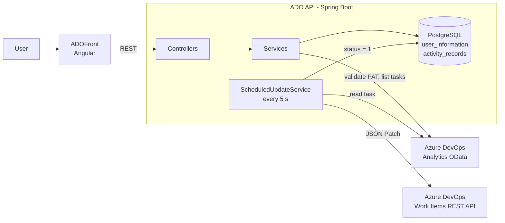

# ADO

Time tracking for Azure DevOps tasks. You start a timer on a task, stop it when you are done, and the API writes the time to the work item in Azure DevOps (*Completed Work* and *Remaining Work*) for you.

The front end lives in a separate repository: [ADOFront](https://github.com/DiegoHahn/ADOFront).

<!-- TODO(Diego): add screenshots (activity form, report) and maybe a short GIF of the timer flow. -->
<!--  -->
<!--  -->

## The problem

Logging hours in Azure DevOps means opening each task, doing the math on *Completed Work* and *Remaining Work*, and saving it, every time you switch tasks. It is easy to forget and easy to get wrong. ADO turns that into "start timer, stop timer" and does the bookkeeping.

## How it works

1. **User setup.** The user registers an email, a board (Azure DevOps project) and a Personal Access Token (PAT). Before saving, the API calls the Azure DevOps Analytics API with that token to check it is valid and to find the user's Azure DevOps ID.
2. **Picking a task.** Given a user story ID, the API queries the Analytics OData endpoint for the child tasks assigned to that user, with their estimate, remaining and completed work.
3. **Tracking time.** When the timer stops, the front end posts an activity record (task, start time, tracked time). The record is saved with status `1` (pending) and the request returns right away.
4. **Sync to Azure DevOps.** `ScheduledUpdateService` runs every 5 seconds (`@Scheduled(fixedRate = 5000)`), takes up to 20 pending records, and for each one:
   - reads the current values of the task from Azure DevOps;
   - adds the tracked time to *Completed Work* and subtracts it from *Remaining Work* (or from *Original Estimate* when there is no remaining work yet). Closed tasks only get *Completed Work* updated;
   - sends a JSON Patch to the work item through the REST API.
5. **Failures.** If the sync fails (for example because the token expired) the record gets status `2`. When the user updates their settings, for example with a new token, their failed records go back to status `1` and the next run retries them.

| Status | Meaning |
|---|---|
| `1` | Pending: waiting for the scheduler |
| `0` | Synced to Azure DevOps |
| `2` | Failed: retried after the user updates their settings |

### Architecture



### API endpoints

| Method | Path | Purpose |
|---|---|---|
| `POST` | `/userInformation` | Create or update a user (email, board, PAT) |
| `POST` | `/userInformation/details` | Get a user's settings by email (the token itself is never returned) |
| `POST` | `/workitems/userstory` | List the user's tasks under a user story |
| `POST` | `/activityRecord` | Save a tracked time record (queued for sync) |
| `GET` | `/activityRecord/byDate?userId=&date=YYYY-MM-DD` | Synced records for a day |
| `GET` | `/activityRecord/byWorkItemId?userId=&workItemId=` | Synced records for a task |

## Stack

- Java 17, Spring Boot 3.3 (Web, Data JPA, Scheduling)
- PostgreSQL
- Java `HttpClient` for the Azure DevOps REST and Analytics (OData) APIs
- JUnit 5, Mockito, JaCoCo; H2 for the Spring context in tests
- Docker and Docker Compose for the local environment

## Running locally with Docker Compose

Requirements: Docker with Compose v2.

```bash
cp .env.example .env
# edit .env: your Azure DevOps organization URLs and a PAT_ENCRYPTION_KEY
#   openssl rand -base64 32
docker compose up --build
```

The API is on `http://localhost:8080` and PostgreSQL on `localhost:5432`.

To also run the front end, clone [ADOFront](https://github.com/DiegoHahn/ADOFront) next to this repository (`../ADOFront`) and enable the `front` profile:

```bash
docker compose --profile front up --build
```

The front end is then on `http://localhost:4200`. You can also run it on its own with `npm start` from the ADOFront folder.

## Running without Docker

Requirements: JDK 17 and a PostgreSQL database.

```bash
export DB_URL=jdbc:postgresql://localhost:5432/ado
export DB_USERNAME=ado
export DB_PASSWORD=...
export ADO_ORGANIZATION_URL=https://dev.azure.com/your-organization/
export ADO_ANALYTICS_ORGANIZATION_URL=https://analytics.dev.azure.com/your-organization/
export PAT_ENCRYPTION_KEY=$(openssl rand -base64 32)
sh mvnw spring-boot:run
```

## Configuration

| Variable | Default | Description |
|---|---|---|
| `DB_URL` | `jdbc:postgresql://localhost:5432/ado` | JDBC URL of the database |
| `DB_USERNAME` | `ado` | Database user |
| `DB_PASSWORD` | `ado` | Database password. The default only makes sense for a local database |
| `JPA_DDL_AUTO` | `update` | Hibernate schema mode |
| `ADO_ORGANIZATION_URL` | `https://dev.azure.com/your-organization/` | Azure DevOps organization, used for the Work Items REST API |
| `ADO_ANALYTICS_ORGANIZATION_URL` | `https://analytics.dev.azure.com/your-organization/` | Same organization on the Analytics (OData) host |
| `PAT_ENCRYPTION_KEY` | none | Base64 of 32 random bytes. Encrypts the stored PATs with AES-256-GCM, and the API does not start without it (see note) |

With Docker Compose, the database variables come from `POSTGRES_DB`, `POSTGRES_USER` and `POSTGRES_PASSWORD` in `.env` (see `.env.example`).

Note: token encryption comes with the `feat/encrypt-stored-pats` change. Until it is merged, `PAT_ENCRYPTION_KEY` is passed to the container but not used.

## Testing

```bash
sh mvnw test
```

Tests use an in-memory H2 database (`src/test/resources/application.properties`), so no PostgreSQL is needed. A JaCoCo report is written to `target/site/jacoco`.

## Known limitations

- There is no authentication between the front end and the API: users are identified by email only. It is meant for personal or local use.
- The scheduler polls the database every 5 seconds instead of using a message queue.
- CORS accepts any origin.

## Related

- [ADOFront](https://github.com/DiegoHahn/ADOFront): Angular front end.
